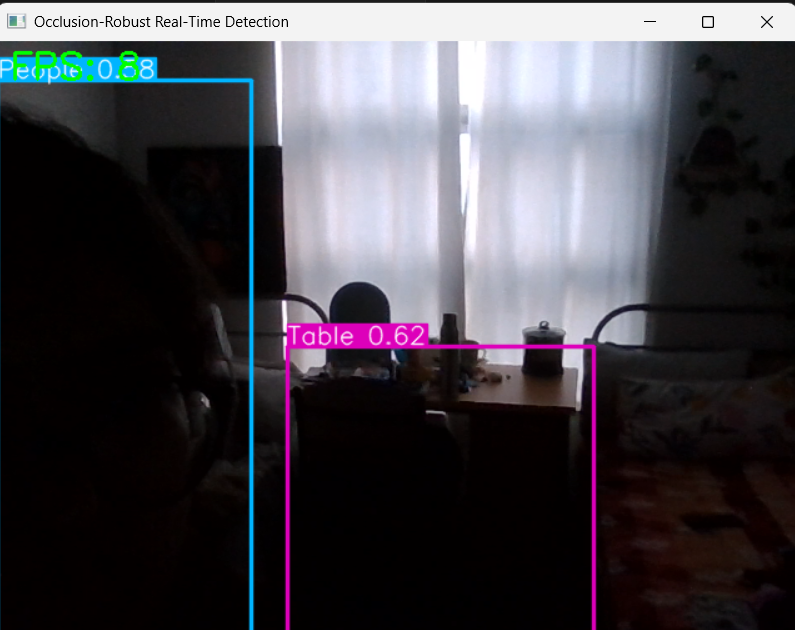
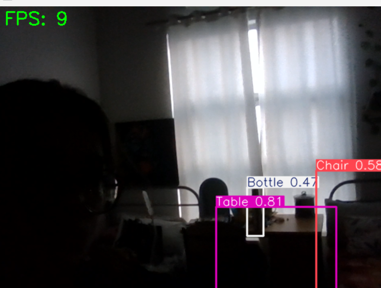

# Low-Light & Occluded Object Detection

YOLOv8-based object detection system optimized for low-light and partially occluded environments using the ExDark dataset.

---

## Features

- Real-time object detection using YOLOv8
- Low-light image enhancement using CLAHE and Gamma Correction
- Synthetic occlusion dataset generation (25%, 50%, 75%)
- Detection under challenging visibility conditions
- Webcam/image-based inference pipeline using OpenCV
- Performance evaluation using mAP metrics

---

## Tech Stack

- Python
- YOLOv8
- PyTorch
- OpenCV
- NumPy
- Ultralytics

---

## Sample Results

| Detection Result 1 | Detection Result 2 |
|-------------------|-------------------|
|  |  |

---

## Real-Time Detection Demo


---

## Model Performance

- Achieved **0.90 mAP@50** on moderate occlusion dataset (occ50)
- Improved detection robustness in low-light environments
- Evaluated performance across multiple occlusion conditions

---

## Dataset

- ExDark Dataset
- Custom synthetic occlusion datasets generated for robustness evaluation

---

## Project Pipeline

1. Data Collection
2. YOLO Format Conversion
3. Occlusion Dataset Generation
4. Image Enhancement (CLAHE + Gamma Correction)
5. YOLOv8 Training
6. Model Evaluation
7. Real-Time Inference

---

## Future Improvements

- Video stream inference optimization
- Edge-device deployment
- Multi-object tracking integration
- Browser-based real-time detection

---

## Installation

```bash
git clone https://github.com/dazz-6/LowLightObjectDetection.git
cd LowLightObjectDetection

pip install -r requirements.txt
